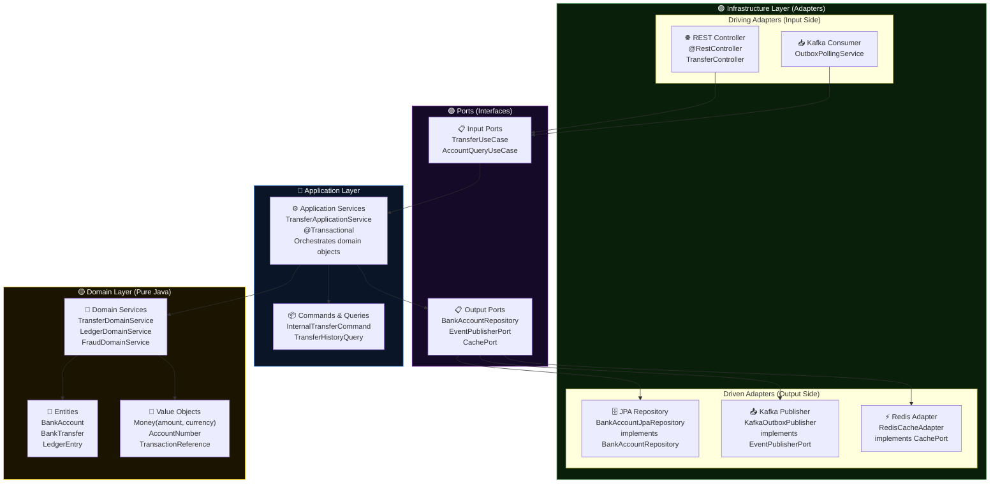
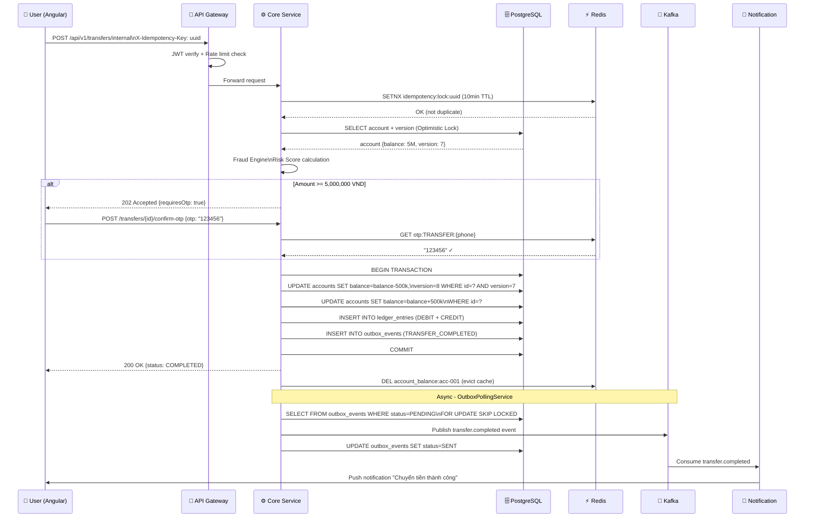
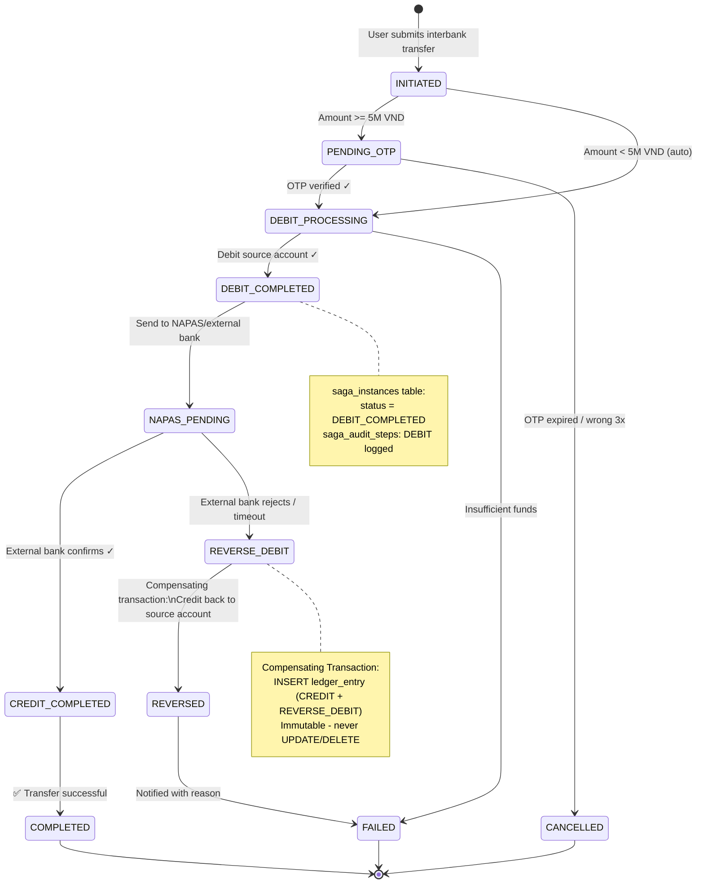
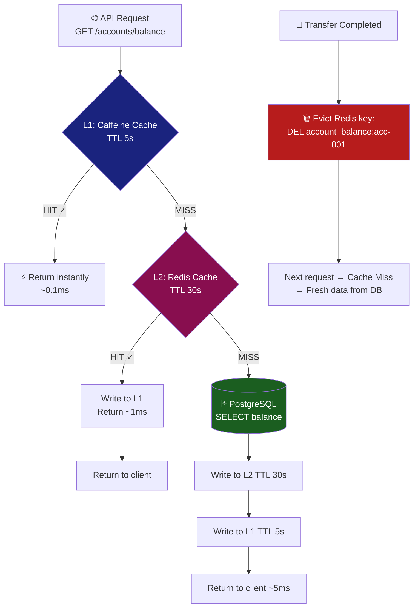
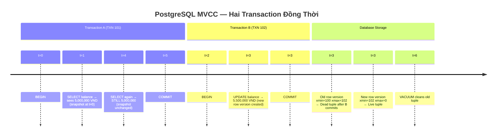

# 🖼️ BankX Architecture Diagrams

> Bộ sơ đồ kiến trúc hệ thống Titan BankX — Angular Signals, NgRx, Clean Architecture, Transfer Flow

---

## 1. Angular Signals Reactive Flow


**Giải thích:**
- `signal()` → WritableSignal, có thể `.set()` / `.update()`
- `computed()` → Lazy, chỉ tính lại khi dependency thay đổi
- `effect()` → Side effects, tự track dependencies, cleanup tự động
- Không cần Zone.js — CD chỉ chạy khi Signal thực sự thay đổi

---

## 2. NgRx Store Data Flow


**Giải thích vòng tròn:**
```
Component → dispatch(Action) → Effects (HTTP) → loadSuccess Action
→ Reducer (pure fn) → Store (immutable state) → Selector (memoized)
→ Component (view update) → [vòng lặp]
```

---

## 3. Titan BankX System Architecture


**4 Tầng Kiến Trúc:**
| Tầng | Công Nghệ | Vai Trò |
|---|---|---|
| Frontend | Angular 22 | UI + UX |
| API Gateway | Spring Cloud Gateway | Auth, Rate Limit, Routing |
| Services | Java 21 + Virtual Threads | Business Logic |
| Data | PostgreSQL + Redis + Kafka | Lưu trữ + Cache + Events |

---

## 4. Java Clean Architecture / Hexagonal (Mermaid)



---

## 5. Transfer Flow — Luồng Chuyển Tiền Nội Bộ



---

## 6. Saga Orchestration — Interbank Transfer



---

## 7. Redis Caching Strategy



---

## 8. MVCC — PostgreSQL Concurrency



---

*Tất cả diagram được tạo dựa trên code thực tế của Titan BankX Platform*
