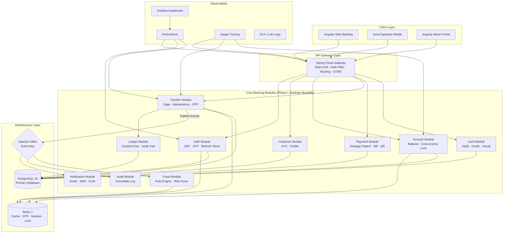
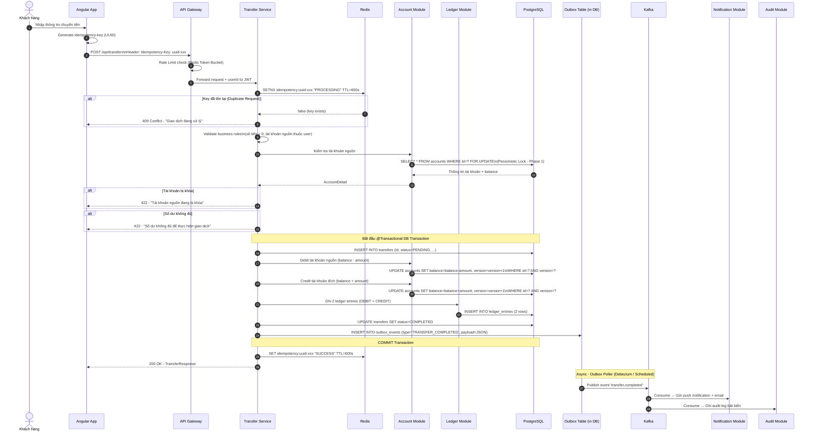

# BankX Digital Banking Platform — Cẩm Nang Kiến Trúc (Architecture Bible)

Tài liệu này là kim chỉ nam kiến trúc không thay đổi trong suốt dự án. Mọi AI Agent và lập trình viên phải đọc tài liệu này trước khi viết bất kỳ dòng code nào.

---

## 1. Triết Lý Kiến Trúc (Architecture Philosophy)

> **"Không nhồi pattern vào vì nghe hay, chỉ áp dụng pattern khi giải quyết bài toán thực tế."**

| Bài Toán | Pattern Áp Dụng | Không Áp Dụng Nếu |
|---|---|---|
| Kafka fail sau DB commit | Transactional Outbox | Service đơn giản, không cần event |
| Hai request rút tiền đồng thời | Optimistic Lock | Read-only endpoint |
| User bấm transfer 2 lần | Idempotency Key | GET API |
| Transfer sang nhiều service | Saga Orchestration | Cùng một DB |
| Đọc transaction history lớn | CQRS (Read Model) | Vài nghìn records |
| Cổng thanh toán hóa đơn đa dạng | Strategy Pattern | Chỉ 1 provider |
| OTP/Session/Rate Limit | Redis | Không cần TTL |

---

## 2. Lộ Trình Kiến Trúc Theo Phase (Phased Architecture)

### Phase 1 — Modular Monolith (Sprint 01–10)
Toàn bộ backend chạy trong **1 Spring Boot application**, chia theo **module/package** rõ ràng. Không phải microservices ngay từ đầu.

```
bankx-backend (Spring Boot)
├── module: auth
├── module: customer
├── module: account
├── module: transaction
├── module: transfer
├── module: payment
├── module: card
├── module: notification
├── module: audit
└── module: fraud
```

> **Lý do:** Giúp hiểu rõ domain trước khi tách. Tránh distributed system complexity khi chưa có domain knowledge vững chắc.

### Phase 2 — Selective Microservices (Sprint 11–20)
Tách các service có traffic/load khác biệt hoặc team khác nhau:
- `notification-service` → Kafka consumer độc lập
- `auth-service` → Security-sensitive, độc lập
- `fraud-service` → ML/Rule engine, cần scale riêng

### Phase 3 — Full Microservices + Kubernetes (Sprint 21+)
- Toàn bộ modules thành services độc lập
- Kubernetes, HPA, Helm charts
- Service Mesh (Istio optional)

---

## 3. Sơ Đồ Tổng Quan Hệ Thống (System Topology)



---

## 4. Kiến Trúc Nội Module (Intra-Module Architecture)

Mỗi module trong Modular Monolith phải tuân theo **Clean Architecture / Hexagonal Architecture**:

```
module: transfer/
├── domain/                          # Lớp nghiệp vụ cốt lõi (Pure Java, KHÔNG có Spring/JPA)
│   ├── model/                       # Domain Entity (BankTransfer, TransferStatus)
│   │   ├── BankTransfer.java        # Aggregate Root
│   │   └── TransferStatus.java      # Enum trạng thái
│   ├── valueobject/                 # Value Objects (Money, AccountId, TransferId)
│   │   ├── Money.java               # amount + currency, không để BigDecimal rải rắc
│   │   └── TransferId.java          # Wrapper quanh UUID
│   ├── service/                     # Domain Service (business rules không thuộc về Entity)
│   │   └── TransferDomainService.java
│   ├── repository/                  # Interfaces (Ports) — Domain gọi ra DB
│   │   └── TransferRepository.java  # Interface, KHÔNG phải JPA Repository
│   ├── event/                       # Domain Events
│   │   ├── TransferCreatedEvent.java
│   │   └── TransferCompletedEvent.java
│   └── exception/                   # Domain Exceptions
│       ├── InsufficientBalanceException.java
│       └── AccountFrozenException.java
│
├── application/                     # Lớp ứng dụng (Orchestration, Use Cases)
│   ├── usecase/                     # Use Case Interfaces (Ports In)
│   │   ├── CreateTransferUseCase.java
│   │   └── GetTransferHistoryUseCase.java
│   ├── command/                     # CQRS Write side
│   │   └── CreateTransferCommand.java
│   ├── query/                       # CQRS Read side
│   │   └── GetTransferHistoryQuery.java
│   └── service/                     # Application Service (implements Use Cases)
│       └── TransferApplicationService.java
│
├── infrastructure/                  # Lớp hạ tầng (Adapters)
│   ├── persistence/                 # DB Adapter
│   │   ├── entity/                  # JPA Entities (KHÁC với Domain Model)
│   │   │   └── TransferJpaEntity.java
│   │   ├── mapper/                  # Mapping Domain Model ↔ JPA Entity
│   │   │   └── TransferMapper.java
│   │   └── repository/              # Implements TransferRepository interface
│   │       └── TransferRepositoryAdapter.java
│   ├── messaging/                   # Kafka Adapter
│   │   ├── publisher/
│   │   │   └── TransferEventPublisher.java
│   │   └── consumer/
│   │       └── AccountEventConsumer.java
│   └── external/                    # External API calls (liên ngân hàng)
│       └── InterBankAdapter.java
│
└── presentation/                    # REST Adapter
    ├── controller/
    │   └── TransferController.java
    └── dto/
        ├── request/
        │   ├── CreateTransferRequest.java
        │   └── ConfirmOtpRequest.java
        └── response/
            ├── TransferResponse.java
            └── TransferHistoryResponse.java
```

### Quy tắc phụ thuộc (Dependency Rule):
```
Presentation → Application → Domain ← Infrastructure
```
- **Domain** không import Spring, JPA, Kafka — thuần Java
- **Application** không import JPA Entity, không biết DB là gì
- **Infrastructure** implements interfaces của Domain
- **Presentation** chỉ gọi Application Use Case

---

## 5. Luồng Chuyển Tiền Chi Tiết (Transfer Flow — Sequence Diagram)



---

## 6. Banking Core — Ledger (Double-Entry Bookkeeping)

### Nguyên tắc:
Mọi thay đổi số dư phải được ghi nhận qua **ledger entries**, không phải chỉ `account.balance -= amount`.

```sql
-- Ví dụ: Transfer 2,000,000 VND từ A sang B
-- Transaction TX-001

-- Ledger Entry 1: Ghi nợ tài khoản nguồn
INSERT INTO ledger_entries (id, transaction_id, account_id, entry_type, amount, balance_after, description)
VALUES ('le-001', 'tx-001', 'acc-A', 'DEBIT', 2000000, 8000000, 'Chuyển tiền đến NGUYEN VAN B');

-- Ledger Entry 2: Ghi có tài khoản đích
INSERT INTO ledger_entries (id, transaction_id, account_id, entry_type, amount, balance_after, description)
VALUES ('le-002', 'tx-001', 'acc-B', 'CREDIT', 2000000, 5000000, 'Nhận tiền từ NGUYEN VAN A');

-- Quy tắc: SUM(DEBIT) == SUM(CREDIT) trong cùng transaction
```

---

## 7. Concurrency Control Strategy

### Vấn đề Race Condition:
```
Balance = 10,000,000 VND
Request A: Transfer 8,000,000
Request B: Transfer 8,000,000 (đồng thời)

Nếu không xử lý: Cả hai đọc balance=10M, cả hai pass validation → trừ 16M → balance âm!
```

### Giải pháp theo Phase:

**Phase 1 (Đơn giản, học nền):** Pessimistic Lock
```java
// SELECT * FROM accounts WHERE id=? FOR UPDATE
@Lock(LockModeType.PESSIMISTIC_WRITE)
Optional<AccountJpaEntity> findByIdWithLock(UUID accountId);
```

**Phase 2 (Scalable):** Optimistic Lock
```java
@Version
private Long version;
// JPA sẽ tự động thêm WHERE version=? vào UPDATE
// Nếu version không khớp → OptimisticLockException → Retry 3 lần
```

**Phase 3 (High Concurrency):** Redis Distributed Lock
```java
// Dùng Redisson RedissonClient
RLock lock = redissonClient.getLock("account:lock:" + accountId);
lock.lock(5, TimeUnit.SECONDS);
try { /* business logic */ } finally { lock.unlock(); }
```

---

## 8. Outbox Pattern Implementation

```java
// Trong @Transactional Transfer Service:

// Bước 1: Lưu Transfer vào DB
transferRepository.save(transfer);

// Bước 2: Lưu Ledger Entries vào DB
ledgerRepository.saveAll(ledgerEntries);

// Bước 3: Ghi Outbox Event (CÙNG TRANSACTION với bước 1 và 2)
// → Đảm bảo atomicity: DB thành công ↔ Event được ghi
outboxRepository.save(OutboxEvent.builder()
    .id(UUID.randomUUID())
    .eventType("TRANSFER_COMPLETED")
    .aggregateId(transfer.getId().toString())
    .payload(objectMapper.writeValueAsString(transferCompletedEvent))
    .status(OutboxStatus.PENDING)
    .createdAt(Instant.now())
    .build());

// COMMIT tất cả 3 bước ở đây

// Bước 4 (Async - Scheduled Poller chạy mỗi 1s):
// Đọc outbox_events WHERE status='PENDING' → Publish Kafka → Update status='SENT'
```

---

## 9. Saga Pattern — Transfer Flow với Rollback

Khi Transfer liên quan đến nhiều service (Phase 2+ microservices):

```
Step 1: Debit Account A          → Success → Step 2
Step 2: Credit Account B         → FAILURE → Compensation!
Compensation Step 1: Reverse Debit Account A (credit back)
Compensation Step 2: Set Transfer Status = FAILED
Compensation Step 3: Notify User "Chuyển tiền thất bại, tiền đã hoàn về"
```

---

## 10. Module Dependencies & Boundaries

```
auth-module
  └── provides: SecurityContext (userId, roles)
  └── no dependency on other modules

customer-module
  └── depends on: auth-module
  └── provides: CustomerProfile

account-module
  └── depends on: auth-module, customer-module
  └── provides: AccountDetail, BalanceCheck port

transfer-module
  └── depends on: auth-module, account-module, ledger-module
  └── publishes: TransferCreated, TransferCompleted events

ledger-module
  └── depends on: account-module
  └── standalone: chỉ nhận ghi chép từ transfer, payment

payment-module
  └── depends on: auth-module, account-module, ledger-module

notification-module
  └── consumes Kafka events: TRANSFER_COMPLETED, PAYMENT_COMPLETED
  └── no dependency on other modules (event-driven)

audit-module
  └── consumes ALL domain events
  └── write-only, no outgoing dependencies

fraud-module
  └── consumes: transaction events, account events
  └── provides: RiskScore via Kafka reply or sync call
```

---

## 11. Redis Usage Map

| Use Case | Key Pattern | TTL | Data Structure |
|---|---|---|---|
| OTP | `otp:{userId}:{purpose}` | 120s | String |
| Refresh Token | `refresh:{tokenId}` | 7 days | String |
| Idempotency | `idempotency:{key}` | 10 min | String |
| Rate Limit | `rate_limit:{userId}:{api}` | 1 min | Sorted Set / Counter |
| Account Balance Cache | `account:balance:{accountId}` | 30s | String |
| Session | `session:{sessionId}` | 30 min | Hash |
| Distributed Lock | `lock:account:{accountId}` | 5s | String (Redisson) |
| Fraud Score Cache | `fraud:score:{userId}` | 5 min | String |

---

## 12. API Gateway Responsibilities

```yaml
# Tất cả request đi qua Gateway trước
Gateway nhận request:
  1. Rate Limit check (Redis Token Bucket per userId/IP)
  2. JWT validation (verify signature + expiry)
  3. Extract userId, roles → inject vào downstream header
  4. Correlation ID injection (X-Trace-Id)
  5. Request/Response logging
  6. Route tới service tương ứng
  7. Circuit Breaker (Resilience4j) nếu service down
```

---

## 13. Security Architecture

```
Layer 1 - Network: HTTPS only, CORS configuration
Layer 2 - Gateway: JWT validation, Rate Limiting
Layer 3 - Service: Spring Security RBAC (@PreAuthorize)
Layer 4 - DB: Parameterized queries (no SQL injection)
Layer 5 - Data: Sensitive data masking in logs
Layer 6 - Audit: Immutable audit trail mọi hành động
```

### JWT Flow:
```
Login → Access Token (15 phút) + Refresh Token (7 ngày, lưu Redis)
→ Access Token expired → Gửi Refresh Token → Nhận cặp token mới
→ Refresh Token Rotation: Token cũ bị vô hiệu hóa ngay sau khi đổi
→ Token bị đánh cắp: Revoke Refresh Token trong Redis → Tất cả session logout
```
